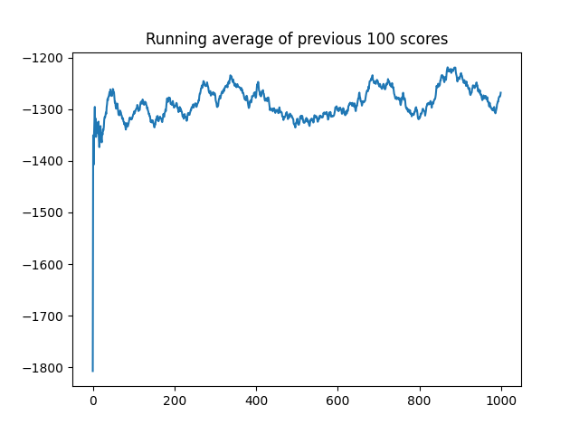

# ddpg-paper-reimplementation


---

## 🎯 Introduction
A clean, modular reimplementation of "Continuous Control with Deep Reinforcement Learning" (ICLR 2016, Lillicrap et al.) in TensorFlow, designed for reproducibility, extensibility, and research comparison.

---

## 📖 Description
This project implements the Deep Deterministic Policy Gradient (DDPG) algorithm, a model-free, off-policy actor-critic method for continuous control. It features:
- Modular codebase (separate agent, networks, buffer, noise, wrappers)
- Configurable hyperparameters via YAML
- Experiment tracking (TensorBoard, config archiving)
- Hyperparameter sweeps and result comparison
- Unit tests for all modules
- Reproducibility (seed control, config/version logging)

---

## 🖼️ Visuals


To compare multiple runs, use `python compare_results.py` to generate aggregate plots from all experiments in `results/`.

---

## ⚡ Prerequisites / Requirements
- Python 3.10+
- Conda (recommended)
- Apple Silicon: `tensorflow-macos`, `tensorflow-metal`
- See `requirements.txt` and `requirements-lock.txt` for all dependencies

---

## 🛠️ Technologies Used
- TensorFlow 2.x
- OpenAI Gym
- NumPy
- Matplotlib
- PyYAML
- pytest, flake8, black (for testing/linting)

---

## 🚀 Quickstart

1. **Clone the repository**
   ```sh
   git clone https://github.com/yourusername/ddpg-paper-reimplementation.git
   cd ddpg-paper-reimplementation
   ```

2. **Create and activate a Python environment**
   ```sh
   conda create -n DDPG python=3.10
   conda activate DDPG
   ```

3. **Install dependencies**
   ```sh
   pip install -r requirements.txt
   ```

4. **Run a single experiment**
   ```sh
   ./train.sh
   # or
   python src/main.py --config config.yaml
   ```

5. **Run all tests**
   ```sh
   ./test.sh
   # or
   pytest tests
   ```

6. **Run a hyperparameter sweep**
   ```sh
   python sweep.py
   ```

7. **Compare results**
   ```sh
   python compare_results.py
   ```

8. **View TensorBoard logs**
   ```sh
   tensorboard --logdir runs
   ```

---

## ⚡ Advanced Usage
- **Hyperparameter Sweeps:**
  ```sh
  python sweep.py
  ```
  This will run multiple experiments with different hyperparameters and save results in `results/` and `experiments/`.

- **Compare Results:**
  ```sh
  python compare_results.py
  ```
  This will plot all learning curves from the sweep for easy comparison.

- **TensorBoard Tracking:**
  ```sh
  tensorboard --logdir runs
  ```
  View experiment metrics and hyperparameters in your browser.

- **Pretrained Models:**
  Place `.h5` model files in the project root or specify paths in `config.yaml`. Call `agent.load_models()` in `src/main.py` to load them before training or evaluation.

---

## ⚙️ Configuration

All hyperparameters and environment settings are in [`config.yaml`](config.yaml):

| Key                   | Description                                      | Example         |
|-----------------------|--------------------------------------------------|-----------------|
| `env`                 | Gym environment name                             | `Pendulum-v1`   |
| `agent.alpha`         | Actor learning rate                              | `0.0001`        |
| `agent.beta`          | Critic learning rate                             | `0.001`         |
| `agent.input_dims`    | State space dimensions                           | `[3]`           |
| `agent.tau`           | Soft update parameter for target networks        | `0.001`         |
| `agent.batch_size`    | Batch size for training                          | `64`            |
| `agent.layer1_size`   | First hidden layer size                          | `400`           |
| `agent.layer2_size`   | Second hidden layer size                         | `300`           |
| `agent.n_actions`     | Number of action dimensions                      | `1`             |
| `agent.gamma`         | Discount factor                                  | `0.99`          |
| `agent.max_size`      | Replay buffer size                               | `1000000`       |
| `actor_path`          | Path to save/load actor weights                  | `actor.h5`      |
| `critic_path`         | Path to save/load critic weights                 | `critic.h5`     |
| `target_actor_path`   | Path to save/load target actor weights           | `target_actor.h5`|
| `target_critic_path`  | Path to save/load target critic weights          | `target_critic.h5`|

You can override any value by editing `config.yaml` or passing a different file with `--config`.

---

## 🧪 Automated Test
- All modules have unit tests in `tests/`.
- Run `pytest tests` or `./test.sh` to verify correctness.

---

## 📁 Folder Structure
```
├── src/                # Main source code
│   ├── agent.py
│   ├── env_wrappers.py
│   ├── main.py
│   ├── networks.py
│   ├── ou_noise.py
│   ├── replay_buffer.py
│   └── utils.py
├── tests/              # Unit tests
├── results/            # Plots and raw scores from experiments
├── experiments/        # Archived config files for each run
├── runs/               # TensorBoard logs
├── sweep.py            # Hyperparameter sweep script
├── compare_results.py  # Aggregate and plot results
├── train.sh            # Training script
├── test.sh             # Test script
├── plot.sh             # (Optional) Plotting script
├── config.yaml         # Main config
├── requirements.txt    # Main dependencies
├── requirements-lock.txt # Locked dependencies
├── README.md           # This file
```

---

## 🛣️ Roadmap
- [x] Modularize codebase
- [x] Add config file and logging
- [x] Add unit tests
- [x] Add experiment tracking (TensorBoard)
- [x] Add hyperparameter sweeps
- [x] Add result comparison script
- [ ] Add more environments (e.g., MuJoCo, Cartpole)
- [ ] Add pretrained model weights
- [ ] Add advanced logging (e.g., Weights & Biases)
- [ ] Add Dockerfile for full reproducibility

---

## 🤝 Contribution
Contributions are welcome! Please see `CONTRIBUTING.md` for guidelines. To propose a feature or report a bug, open an issue or submit a pull request.

---

## 📚 Documentation & FAQ
- For more details, see the `docs/` folder.
- If you encounter issues, check the FAQ in the docs or open an issue.

---

## ❓ FAQ / Troubleshooting

**Q: I get a TensorFlow error about Apple Silicon.**
A: Make sure you installed `tensorflow-macos` and `tensorflow-metal` as described in the requirements.

**Q: My results are different each run.**
A: Check that you set the `seed` in `config.yaml` and that all dependencies match those in `requirements-lock.txt`.

**Q: How do I add a new environment?**
A: Change the `env` key in `config.yaml` to your desired Gym environment and adjust `input_dims`/`n_actions` as needed.

**Q: How do I resume training from a checkpoint?**
A: Place your `.h5` model files in the project root or specify their paths in `config.yaml`, then call `agent.load_models()` in `src/main.py`.

---

## 📊 Research Comparison
| Environment | DDPG (Paper, Low-Dim) | DDPG (Paper, Pixels) | This Repo (Low-Dim) | Notes/Discrepancies |
|-------------|-----------------------|----------------------|---------------------|---------------------|
| Pendulum    | 0.95                  | 0.66                 | (fill in)           | -                   |
| Cartpole    | 0.84                  | 0.48                 | (fill in)           | -                   |
| Cheetah     | 0.90                  | 0.46                 | (fill in)           | -                   |
| Walker2d    | 0.70                  | 0.94                 | (fill in)           | -                   |
| Torcs       | ~1840 (raw)           | ~1876 (raw)          | N/A                 | Not tested          |

> Please update the table as you run more experiments!

---

## 📝 License
MIT License