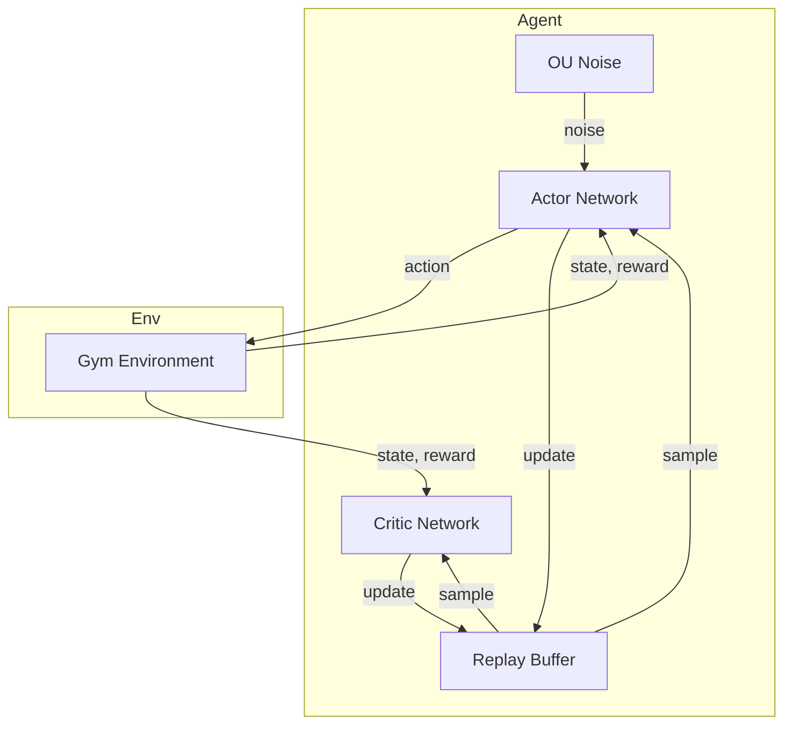

# Architecture

## DDPG System Overview

```mermaid
flowchart TD
    subgraph Agent
        A1[Actor Network]
        A2[Critic Network]
        A3[Replay Buffer]
        A4[OU Noise]
    end
    subgraph Env
        E1[Gym Environment]
    end
    A1 -- action --> E1
    E1 -- state, reward --> A1
    E1 -- state, reward --> A2
    A1 -- update --> A3
    A2 -- update --> A3
    A3 -- sample --> A1
    A3 -- sample --> A2
    A4 -- noise --> A1
```

> Edit this diagram as your architecture evolves!