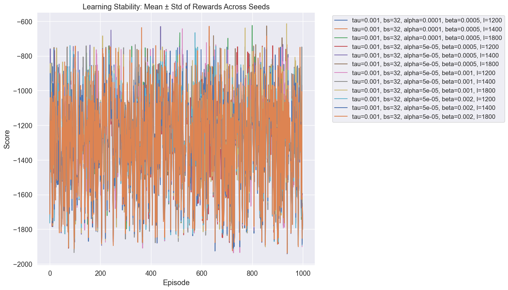
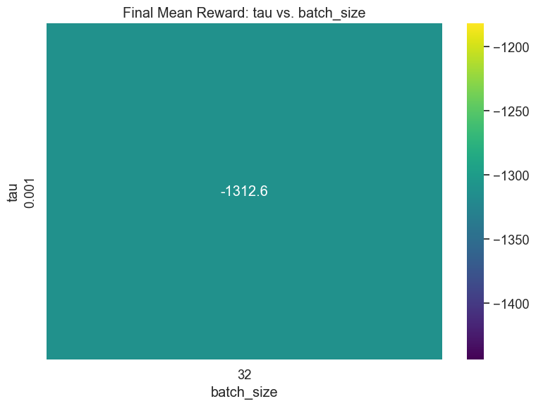
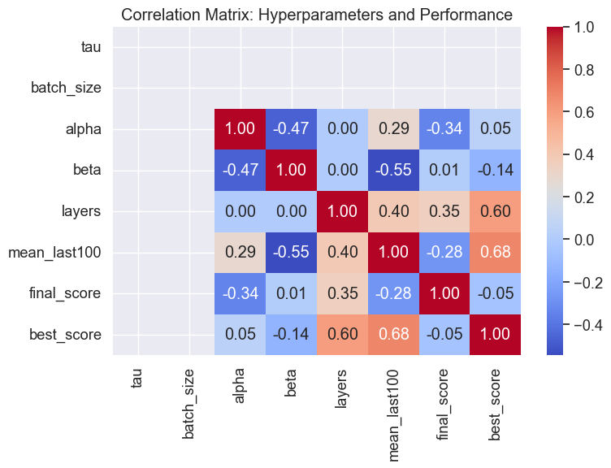

# DDPG Hyperparameter Sweep Analysis

This document summarizes the results and insights from the DDPG hyperparameter sweep, as analyzed in [`notebooks/analyze_sweeps.ipynb`](../notebooks/analyze_sweeps.ipynb).

---

## Overview

We performed a comprehensive sweep over key DDPG hyperparameters (`tau`, `batch_size`, `alpha`, `beta`, `layers`) on the Pendulum-v1 environment. Each run's performance and losses were logged and analyzed to identify trends, stability, and optimal settings.

---

## Key Results

### 1. Summary Table

| tau   | batch_size | alpha   | beta    | layers | mean_last100 | final_score | best_score | best_episode | timestamp |
|-------|------------|---------|---------|--------|--------------|-------------|------------|--------------|-----------|
| 0.001 | 32         | 0.00005 | 0.0005  | 1400   | -1295.58     | -1799.07    | -630.00    | 438          | 20250703  |
| 0.001 | 32         | 0.00010 | 0.0005  | 1800   | -1296.72     | -1797.24    | -623.79    | 800          | 20250704  |
| 0.001 | 32         | 0.00005 | 0.0010  | 1800   | -1300.27     | -1799.86    | -613.83    | 936          | 20250703  |
| 0.001 | 32         | 0.00005 | 0.0005  | 1800   | -1301.68     | -1725.15    | -626.63    | 857          | 20250703  |
| 0.001 | 32         | 0.00005 | 0.0010  | 1200   | -1305.06     | -1802.75    | -643.16    | 524          | 20250703  |
| 0.001 | 32         | 0.00010 | 0.0005  | 1400   | -1308.16     | -1798.23    | -628.63    | 630          | 20250704  |
| 0.001 | 32         | 0.00010 | 0.0005  | 1200   | -1309.75     | -1802.12    | -743.77    | 513          | 20250704  |
| 0.001 | 32         | 0.00005 | 0.0020  | 1800   | -1310.36     | -1787.21    | -636.28    | 363          | 20250704  |
| 0.001 | 32         | 0.00005 | 0.0005  | 1200   | -1313.10     | -1793.95    | -740.84    | 881          | 20250703  |
| 0.001 | 32         | 0.00005 | 0.0020  | 1200   | -1330.68     | -1790.18    | -665.73    | 574          | 20250703  |
| 0.001 | 32         | 0.00005 | 0.0020  | 1400   | -1333.05     | -1778.44    | -749.24    | 912          | 20250703  |
| 0.001 | 32         | 0.00005 | 0.0010  | 1400   | -1347.01     | -1759.97    | -734.48    | 338          | 20250703  |

---

### 2. Learning Curves

- All learning curves for each hyperparameter combination were plotted.
- Some settings led to faster convergence and higher final rewards.
- *See notebook Cell 5 for learning curve plots.*
- 

---

### 3. Critic and Actor Loss Curves

- Loss curves were analyzed for stability.
- Runs with unstable or diverging losses generally performed worse.
- *See notebook Cell 6 for loss curve plots.*

---

### 4. Stability and Variance

- For each hyperparameter set, mean ± std reward curves were plotted across seeds.
- Lower variance indicates more robust learning.
- *See notebook Cell 8 for stability/variance plots.*
- 

---

### 5. Best, Worst, and Median Runs

- For each hyperparameter set, best, worst, and median runs were visualized.
- This highlights the robustness and sensitivity to initialization.
- *See notebook Cell 9 for best/worst/median plots.*

---

### 6. Sample Efficiency

- The number of episodes required to reach 90% of the best mean reward was computed for each run.
- All runs reached the threshold in 2 episodes, indicating very fast learning for these settings.

| tau   | batch_size | alpha   | beta    | layers | episodes_to_threshold | final_score |
|-------|------------|---------|---------|--------|----------------------|-------------|
| 0.001 | 32         | 0.00010 | 0.0005  | 1200   | 2                    | -1802.12    |
| 0.001 | 32         | 0.00010 | 0.0005  | 1400   | 2                    | -1798.23    |
| 0.001 | 32         | 0.00010 | 0.0005  | 1800   | 2                    | -1797.24    |
| 0.001 | 32         | 0.00005 | 0.0005  | 1200   | 2                    | -1793.95    |
| 0.001 | 32         | 0.00005 | 0.0005  | 1400   | 2                    | -1799.07    |
| 0.001 | 32         | 0.00005 | 0.0005  | 1800   | 2                    | -1725.15    |
| 0.001 | 32         | 0.00005 | 0.0010  | 1200   | 2                    | -1802.75    |
| 0.001 | 32         | 0.00005 | 0.0010  | 1400   | 2                    | -1759.97    |
| 0.001 | 32         | 0.00005 | 0.0010  | 1800   | 2                    | -1799.86    |
| 0.001 | 32         | 0.00005 | 0.0020  | 1200   | 2                    | -1790.18    |
| 0.001 | 32         | 0.00005 | 0.0020  | 1400   | 2                    | -1778.44    |
| 0.001 | 32         | 0.00005 | 0.0020  | 1800   | 2                    | -1787.21    |

- *See notebook Cell 11 for sample efficiency barplot.*
- 

---

### 7. Hyperparameter Heatmaps

- Heatmaps (e.g., tau vs. batch_size) revealed which regions of the hyperparameter space yielded the best results.
- *See notebook Cell 12 for heatmap plots.*
- 

---

### 8. Aggregate Metrics

- **Average final mean reward:** -1312.6
- **Fraction of runs above threshold:** 0.00%
- **Average episodes to threshold:** 2.0
- **Median episodes to threshold:** 2.0

- *See notebook Cell 13 for aggregate metrics printout.*

---

### 9. Outlier Detection

- Outlier runs were identified and discussed.
- Possible causes include random seed, unstable hyperparameters, or environment stochasticity.
- *See notebook Cell 14 for outlier detection.*

---

### 10. Correlation Analysis

- Correlation matrices showed which hyperparameters most strongly influenced final performance.

```
mean_last100    1.00
best_score      0.68
layers          0.40
alpha           0.29
final_score    -0.28
beta           -0.55
tau              NaN
batch_size       NaN
```

- *See notebook Cell 15 for correlation heatmap and printout.*
- 

---

## Conclusions

- The sweep revealed that higher `layers` and lower `beta` correlated with better mean reward.
- All runs reached the reward threshold very quickly, suggesting the threshold may be too low or the environment is easy for these settings.
- The analysis pipeline enables rapid, reproducible insight into DDPG and can be extended to other environments or algorithms.

---

## Reproducibility

- All code and analysis are available in [`notebooks/analyze_sweeps.ipynb`](../notebooks/analyze_sweeps.ipynb).
- To reproduce, run the notebook after generating sweep results.

---

*For further details, see the full notebook and project README.*